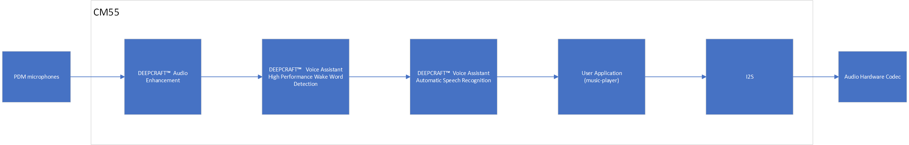
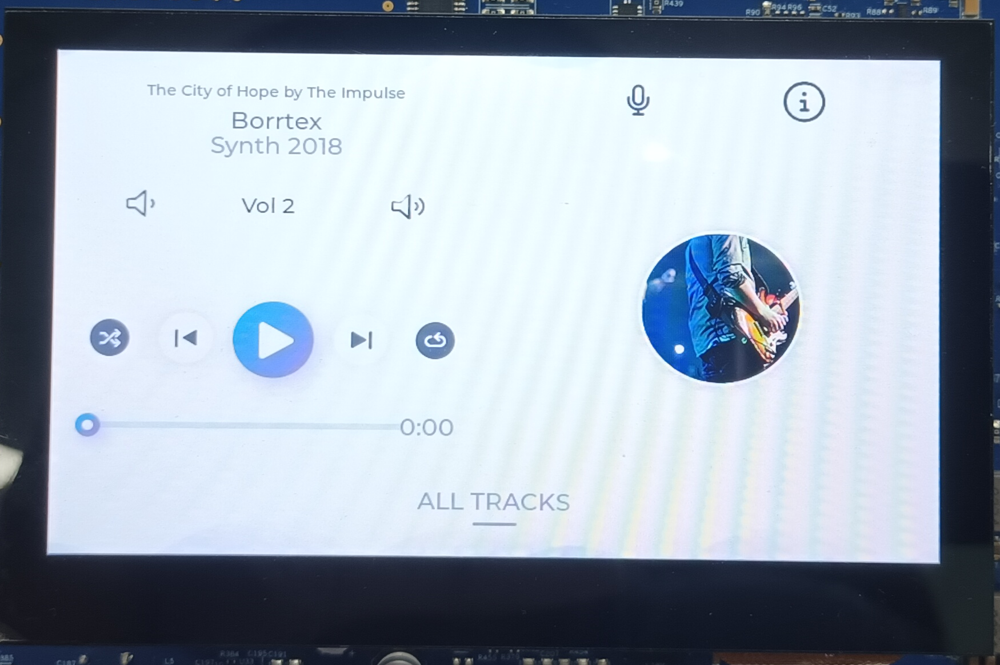
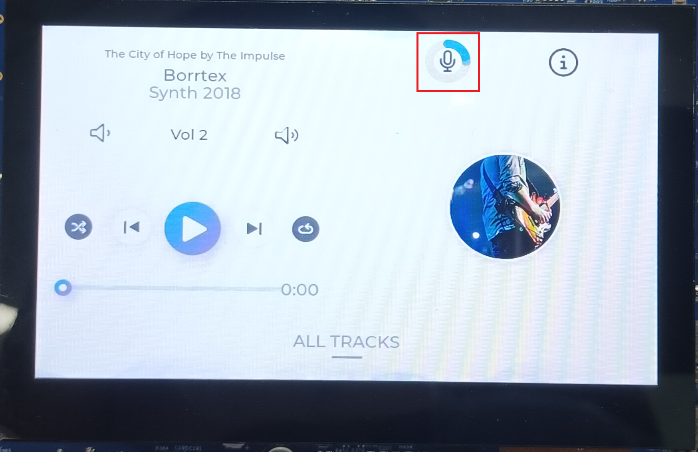
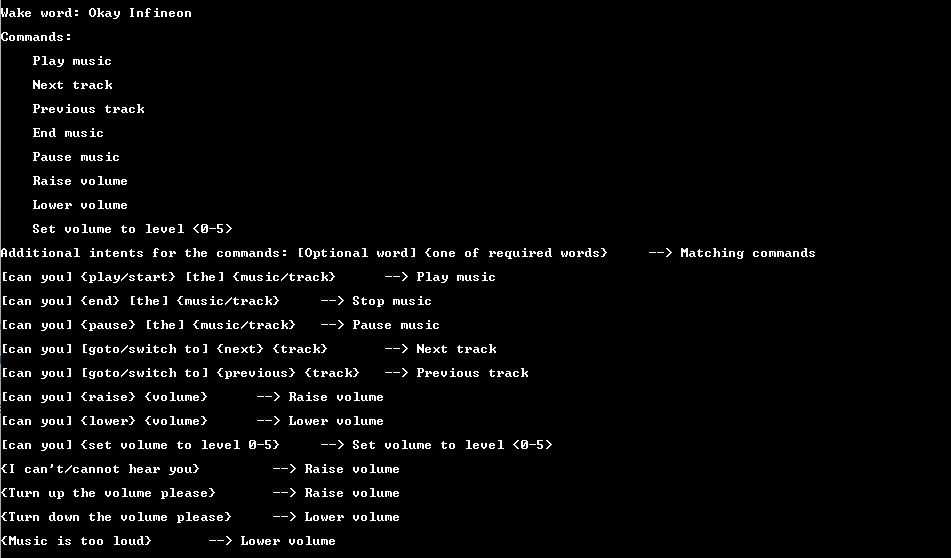

# PSOC&trade; Edge MCU: Mains-powered local voice

This code example illustrates Infineon's PSOC&trade; Edge MCU's "local voice", which refers to its ability to perform speech recognition, audio processing, inferencing, and triggering actions locally at the edge, without relying on cloud connectivity or external servers. 

This example showcases Infineon’s comprehensive solution for voice and audio applications with PSOC&trade; Edge MCU. It demonstrates how to use an audio pipeline on the Arm&reg; Cortex&reg; M55 core starting from audio capture, audio data processing with Infineon's DEEPCRAFT&trade; audio enhancement (AE), audio data inferencing with Infineon's DEEPCRAFT&trade; voice assistant (VA), post processing of inferred results, and performing actions based on the results. Both VA and AE components (noise suppression and echo suppression) utilize Ethos-U55.

The use case given in this code example is a music player with 2D graphics with "Okay/Ok Infineon" as the wakeword and several commands/intents. Refer and customize this code example for any use case.

The following image shows a high-level overview of the audio pipeline:

**Figure 1. Audio pipeline**

This code example has a three project structure - CM33 Secure, CM33 Non-Secure, and CM55 projects. All three projects are programmed to the external Octal SPI (OSPI) flash and executed in XIP mode. Critical codes are executed from SoCMem. Extended Boot launches the custom CM33 Secure project loaded to RRAM , which then configures the protection settings, OSPI flash and launches the CM33 Non-Secure application. Additionally, CM33 Non-Secure application enables CM55 CPU and launches the CM55 application.

The example uses Peripheral Driver Library (PDL) for peripherals such as PDM-PCM, LED, I2S, and GPIO. The TLV310DAC3000 codec is used for playing audio data sent via I2S to the onboard loudspeaker. The example also uses 4.3 inch screen (Waveshare 4.3 inch Raspberry-Pi DSI LCD C 800480 pixel display). 

> **Note:**

> 1. See [Design Guide](docs/local_voice_design_guide.md) for the detailed description of this code example, its design, various options, and KPI details

> 2. This example supports only Arm&reg; and LLVM compilers and requires the Boot SW should be in the "OFF" position

> 3. The audio-voice-core library and VA inferencing library included in this example has a limited operation of about 15 minutes and 30 minutes respectively. For the unlimited license, contact Infineon support. See [Using the code example](docs/using_the_code_example.md) or *notes.md* in *proj_cm55\source\modules\audio_voice_core_lib* for placing the licensed version of libraries within the code folder structure

> 4. On 15 minute timeout, the code will stop. See the Terminal output for more information, reset the board

> 5. To use the mp3 decoder for music player playback, ModusToolbox&trade; Audio SW Codecs Tech Pack should be installed which is a licensed tech pack. Else the music playback will be with wav files. See [Using the code example](docs/using_the_code_example.md)

> 6. This code example supports only Arm&reg; and LLVM compilers, which you need to install separately. See "Software Setup" section below

## Requirements

- [ModusToolbox&trade;](https://www.infineon.com/modustoolbox) v3.6 or later (tested with v3.6)
- Board support package (BSP) minimum required version: 1.0.0
- Programming language: C
- Associated parts: All [PSOC&trade; Edge MCU](https://www.infineon.com/products/microcontroller/32-bit-psoc-arm-cortex/32-bit-psoc-edge-arm) parts

## Supported toolchains (make variable 'TOOLCHAIN')

- Arm&reg; Compiler v6.22 (`ARM`)
- LLVM Embedded Toolchain for Arm&reg; v19.1.5 (`LLVM_ARM`) – Default value of `TOOLCHAIN`

## Supported kits (make variable 'TARGET')

- [PSOC&trade; Edge E84 Evaluation Kit](https://www.infineon.com/KIT_PSE84_EVAL) (`KIT_PSE84_EVAL_EPC2`) – Default value of `TARGET`
- [PSOC&trade; Edge E84 Evaluation Kit](https://www.infineon.com/KIT_PSE84_EVAL) (`KIT_PSE84_EVAL_EPC4`)

## Hardware setup

This example uses the board's default configuration. See the kit user guide to ensure that the board is configured correctly.

Ensure the following jumper and pin configuration on board.
- BOOT SW should be in OFF position to use the OSPI flash
- J20 and J21 must be in the tristate/not connected (NC) position

## Software setup

See the [ModusToolbox&trade; tools package installation guide](https://www.infineon.com/ModusToolboxInstallguide) for information about installing and configuring the tools package.

- Install a terminal emulator if you do not have one. Instructions in this document use [Tera Term](https://teratermproject.github.io/index-en.html)

- Install the DEEPCRAFT&trade; Audio Enhancement Tech Pack to access the AFE Configurator tool

- Install the ModusToolbox&trade; Audio SW Codecs Tech Pack for mp3 music playback (music player use case)

- Install the Audacity tool and (optional) DEEPCRAFT&trade; Studio

- To customize the wake word and commands, access to [DEEPCRAFT&trade; Voice-Assistant Cloud tool](https://deepcraft.infineon.com/solutions/voice-assistant) is required

- Install Arm&reg; Compiler for Embedded version 6.22

	> **Note:** Arm&reg; account and license is required for the [Arm&reg; compiler](https://developer.arm.com/downloads/view/ACOMPE).

	Alternatively, install the [LLVM](https://github.com/ARM-software/LLVM-embedded-toolchain-for-Arm/releases/tag/release-19.1.5) compiler, which does not require a license. 

	Depending on your choice of compiler (Arm&reg;, LLVM), set these env variables on the PC settings or uncomment in *common.mk* and set the path:

	1.	**Arm&reg; Compiler:** 
	CY_COMPILER_ARM_DIR=[path to Arm compiler installation]  
	For example: *C:/Program Files/ArmCompilerforEmbedded6.22*

	2. 	**LLVM Compiler:**  
	CY_COMPILER_LLVM_ARM_DIR=[path to LLVM compiler location]  
	For example: *C:/llvm/LLVM-ET-Arm-19.1.5-Windows-x86_64*

## Operation

1. See [How to build and flash](docs/using_the_code_example.md). After programming, the application starts automatically.

	If graphics is enabled, the following music player is shown on the screen

	**Figure 2. Music player screen at application start**

	

2. After the board is booted up, say the wake word "Okay Infineon". 

	On successful detection, red and green LEDs will glow. If graphics is enabled, the following is displayed, indicating that the kit is waiting for commands

	**Figure 3. Music player graphics – Kit waiting for commands**
	
	

3. After the red and green LEDs glow, speak any of the supported commands or intents as shown in **Figure 4** over UART

	**Figure 4. Supported commands and intents**

	

	Alternatively, see the full list of commands/intents available in the *\proj_cm55\source\mains_powered_application\inferencing_interface\COMPONENT_VOICE_ASSISTANT\va_model\command_list_localvoice_music_nonum.txt* file

3. On successful command detection, observe the blue LED glow along with the red, and the green LED with a graphical transition on the screen

	When the board is in music playback state, all 3 LEDs continue to glow until `End Music` command is inferred.
	
	When the board is not in music playback state, commands such as `Raise Volume` or `Lower Volume` make the LEDs go back off once they are processed

6. Monitor the UART terminal for the detection status; the terminal should print the detection results

7. The LED transitions are only for voice based activation and not for the push-to-talk (PTT) feature 

	For PTT, press the User BTN1 and directly speak the command. Its purpose is to bypass the wakeword.
 
	> **Note:** PTT is only supported for PDM microphone input configurations – and not for USB input configurations. PTT is enabled both during active music playback and listening states – command detection occurs if speech is detected

> **Note:** With graphics enabled, you can control the screen and functionality via touch instead of voice/audio.

## Design guide

See the [Design Guide](docs/local_voice_design_guide.md) for detailed description of this code example, its design, various options, and KPI details.

## Related resources

Resources  | Links
-----------|----------------------------------
Application notes  | [AN235935](https://www.infineon.com/AN235935) – Getting started with PSOC&trade; Edge E8 MCU on ModusToolbox&trade; software   [AN240916](https://www.infineon.com/AN240916) - DEEPCRAFT&trade; Audio Enhancement on PSOC&trade; Edge E84 MCU
Code examples  | [Using ModusToolbox&trade;](https://github.com/Infineon/Code-Examples-for-ModusToolbox-Software) on GitHub
Device documentation | [PSOC&trade; Edge MCU datasheet](https://www.infineon.com/products/microcontroller/32-bit-psoc-arm-cortex/32-bit-psoc-edge-arm#documents)   [PSOC&trade; Edge MCU reference manuals](https://www.infineon.com/products/microcontroller/32-bit-psoc-arm-cortex/32-bit-psoc-edge-arm#documents)
Development kits | Select your kits from the [Evaluation board finder](https://www.infineon.com/cms/en/design-support/finder-selection-tools/product-finder/evaluation-board)
Libraries  | [mtb-dsl-pse8xxgp](https://github.com/Infineon/mtb-dsl-pse8xxgp) – Device support library for PSE8XXGP   [retarget-io](https://github.com/Infineon/retarget-io) – Utility library to retarget STDIO messages to a UART port
Tools  | [ModusToolbox&trade;](https://www.infineon.com/modustoolbox) – ModusToolbox&trade; software is a collection of easy-to-use libraries and tools enabling rapid development with Infineon MCUs for applications ranging from wireless and cloud-connected systems, edge AI/ML, embedded sense and control, to wired USB connectivity using PSOC&trade; Industrial/IoT MCUs, AIROC&trade; Wi-Fi and Bluetooth&reg; connectivity devices, XMC&trade; Industrial MCUs, and EZ-USB&trade;/EZ-PD&trade; wired connectivity controllers. ModusToolbox&trade; incorporates a comprehensive set of BSPs, HAL, libraries, configuration tools, and provides support for industry-standard IDEs to fast-track your embedded application development

 

## Other resources

Infineon provides a wealth of data at [www.infineon.com](https://www.infineon.com) to help you select the right device, and quickly and effectively integrate it into your design.

## Document history

Document title: *CE242044* – *PSOC&trade; Edge MCU: Mains-powered local voice*

 Version | Description of change
 ------- | ---------------------
 1.x.0   | New code example   Early access release
 2.0.0   | GitHub release
 2.0.1   | Fix asset dependencies to latest tag for github release
 

All referenced product or service names and trademarks are the property of their respective owners.

The Bluetooth&reg; word mark and logos are registered trademarks owned by Bluetooth SIG, Inc., and any use of such marks by Infineon is under license.

PSOC&trade;, formerly known as PSoC&trade;, is a trademark of Infineon Technologies. Any references to PSoC&trade; in this document or others shall be deemed to refer to PSOC&trade;.

---------------------------------------------------------

© Cypress Semiconductor Corporation, 2025. This document is the property of Cypress Semiconductor Corporation, an Infineon Technologies company, and its affiliates ("Cypress").  This document, including any software or firmware included or referenced in this document ("Software"), is owned by Cypress under the intellectual property laws and treaties of the United States and other countries worldwide.  Cypress reserves all rights under such laws and treaties and does not, except as specifically stated in this paragraph, grant any license under its patents, copyrights, trademarks, or other intellectual property rights.  If the Software is not accompanied by a license agreement and you do not otherwise have a written agreement with Cypress governing the use of the Software, then Cypress hereby grants you a personal, non-exclusive, nontransferable license (without the right to sublicense) (1) under its copyright rights in the Software (a) for Software provided in source code form, to modify and reproduce the Software solely for use with Cypress hardware products, only internally within your organization, and (b) to distribute the Software in binary code form externally to end users (either directly or indirectly through resellers and distributors), solely for use on Cypress hardware product units, and (2) under those claims of Cypress's patents that are infringed by the Software (as provided by Cypress, unmodified) to make, use, distribute, and import the Software solely for use with Cypress hardware products.  Any other use, reproduction, modification, translation, or compilation of the Software is prohibited.
 
TO THE EXTENT PERMITTED BY APPLICABLE LAW, CYPRESS MAKES NO WARRANTY OF ANY KIND, EXPRESS OR IMPLIED, WITH REGARD TO THIS DOCUMENT OR ANY SOFTWARE OR ACCOMPANYING HARDWARE, INCLUDING, BUT NOT LIMITED TO, THE IMPLIED WARRANTIES OF MERCHANTABILITY AND FITNESS FOR A PARTICULAR PURPOSE.  No computing device can be absolutely secure.  Therefore, despite security measures implemented in Cypress hardware or software products, Cypress shall have no liability arising out of any security breach, such as unauthorized access to or use of a Cypress product. CYPRESS DOES NOT REPRESENT, WARRANT, OR GUARANTEE THAT CYPRESS PRODUCTS, OR SYSTEMS CREATED USING CYPRESS PRODUCTS, WILL BE FREE FROM CORRUPTION, ATTACK, VIRUSES, INTERFERENCE, HACKING, DATA LOSS OR THEFT, OR OTHER SECURITY INTRUSION (collectively, "Security Breach").  Cypress disclaims any liability relating to any Security Breach, and you shall and hereby do release Cypress from any claim, damage, or other liability arising from any Security Breach.  In addition, the products described in these materials may contain design defects or errors known as errata which may cause the product to deviate from published specifications. To the extent permitted by applicable law, Cypress reserves the right to make changes to this document without further notice. Cypress does not assume any liability arising out of the application or use of any product or circuit described in this document. Any information provided in this document, including any sample design information or programming code, is provided only for reference purposes.  It is the responsibility of the user of this document to properly design, program, and test the functionality and safety of any application made of this information and any resulting product.  "High-Risk Device" means any device or system whose failure could cause personal injury, death, or property damage.  Examples of High-Risk Devices are weapons, nuclear installations, surgical implants, and other medical devices.  "Critical Component" means any component of a High-Risk Device whose failure to perform can be reasonably expected to cause, directly or indirectly, the failure of the High-Risk Device, or to affect its safety or effectiveness.  Cypress is not liable, in whole or in part, and you shall and hereby do release Cypress from any claim, damage, or other liability arising from any use of a Cypress product as a Critical Component in a High-Risk Device. You shall indemnify and hold Cypress, including its affiliates, and its directors, officers, employees, agents, distributors, and assigns harmless from and against all claims, costs, damages, and expenses, arising out of any claim, including claims for product liability, personal injury or death, or property damage arising from any use of a Cypress product as a Critical Component in a High-Risk Device. Cypress products are not intended or authorized for use as a Critical Component in any High-Risk Device except to the limited extent that (i) Cypress's published data sheet for the product explicitly states Cypress has qualified the product for use in a specific High-Risk Device, or (ii) Cypress has given you advance written authorization to use the product as a Critical Component in the specific High-Risk Device and you have signed a separate indemnification agreement.
 
Cypress, the Cypress logo, and combinations thereof, ModusToolbox, PSoC, CAPSENSE, EZ-USB, F-RAM, and TRAVEO are trademarks or registered trademarks of Cypress or a subsidiary of Cypress in the United States or in other countries. For a more complete list of Cypress trademarks, visit www.infineon.com. Other names and brands may be claimed as property of their respective owners.