[Click here](../README.md) to view the README.

## Design and implementation

The design of this application is minimalistic to get started with code examples on PSOC&trade; Edge MCU devices. All PSOC&trade; Edge E84 MCU applications have a dual-CPU three-project structure to develop code for the CM33 and CM55 cores. The CM33 core has two separate projects for the secure processing environment (SPE) and non-secure processing environment (NSPE). A project folder consists of various subfolders, each denoting a specific aspect of the project. The three project folders are as follows:

**Table 1. Application projects**

Project | Description
--------|------------------------
*proj_cm33_s* | Project for CM33 secure processing environment (SPE)
*proj_cm33_ns* | Project for CM33 non-secure processing environment (NSPE)
*proj_cm55* | CM55 project

In this code example, at device reset, the secure boot process starts from the ROM boot with the secure enclave (SE) as the root of trust (RoT). From the secure enclave, the boot flow is passed on to the system CPU subsystem where the secure CM33 application starts. After all necessary secure configurations, the flow is passed on to the non-secure CM33 application. Resource initialization for this example is performed by this CM33 non-secure project. It configures the system clocks, pins, clock-to-peripheral connections, and other platform resources. It then enables the CM55 core using the `Cy_SysEnableCM55()` function.

The secure project in this example is a custom project that is executed from the RRAM and configures the OSPI flash.


### Mains-powered local voice with PDM microphone

This section explains the mains-powered configuration of local voice on the Arm&reg; Cortex&reg; M55 core.

In the CM33 non-secure application running on the Arm&reg; Cortex&reg; M33 core, the clocks and system resources are initialized by the BSP initialization function. The retarget-io middleware is configured to use the debug UART.

In the CM55 application running on the Arm&reg; Cortex&reg; M55 core, the clocks and system resources are initialized by the BSP initialization function. The retarget-io middleware is configured to use the debug UART and initialize the user LEDs.

The entire audio pipeline runs on Arm&reg; Cortex&reg; M55. PDM mics are controlled by the CM55 application.

The audio frames from the PDM microphone are fed into audio enhancement (AE). The processed audio frames are then sent to the inferencing engine for the wake word and command detection. Based on the inferred data, the required action is taken and the pre-recorded audio data is played over I2S on the on-board speakers.

The audio front end (AFE) middleware has multiple software components:

- High-pass filter 
- Analysis
- Acoustic echo cancellation (AEC)
- Beamforming
- Dereverberation
- Echo suppression
- Noise suppression
- Synthesis

The audio data flows through each component of AFE depending on whether they are enabled or not. The microphone data is then filtered using a high-pass filter to remove any low-frequency noise or interference. The AEC block uses a reference/playback audio data to cancel out any acoustic echoes. The noise suppression component is used to reduce background noise and improve the clarity of the audio signal. Overall, the AFE components work together to enhance the quality of the audio signal and improve the inferencing performance.

The Noise suppression and Echo suppression components are ML-based and are executed on Ethos-U55. The processed audio data is then sent to the voice assistant for wake word detection and automatic speech recognition. 

See this file for all the commands depending on the voice assistant project loaded to the code example:
*proj_cm55\source\mains_powered_application\inferencing_interface\COMPONENT_VOICE_ASSISTANT\va_model\command_list_[project_name].txt*.

In music player configuration, the three LEDs glow when the music playback is ongoing – They turn off only if you give the `End Music` command. If you speak the wake word when music is playing, music playback gets paused to listen to the commands. Music does not pause for the push-to-talk feature. 

For the music player use case, the played audio is used as AEC reference. If the input source is USB, no AEC is performed as it cannot pick up echoes from the speaker.


### Code structure

The following picture shows the high-level folder organization of the code example.

**Figure 1. High-level folder organization**

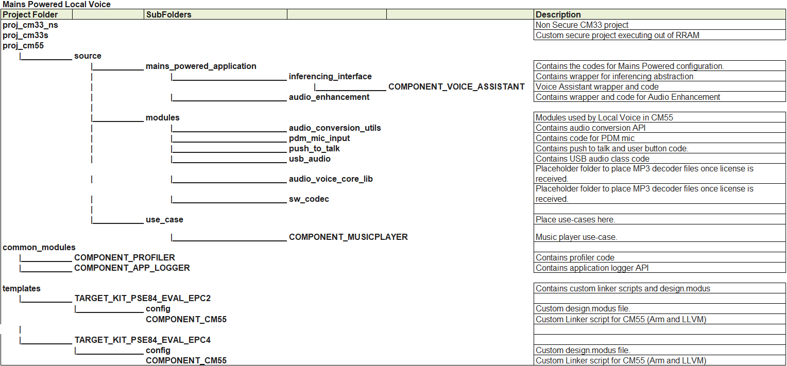
 

### Code flow


The code flow for the mains-powered configuration is shown here for the "Okay Infineon" wakeword and "Play Music" command:

**Figure 2. Code flow for mains-powered configuration**

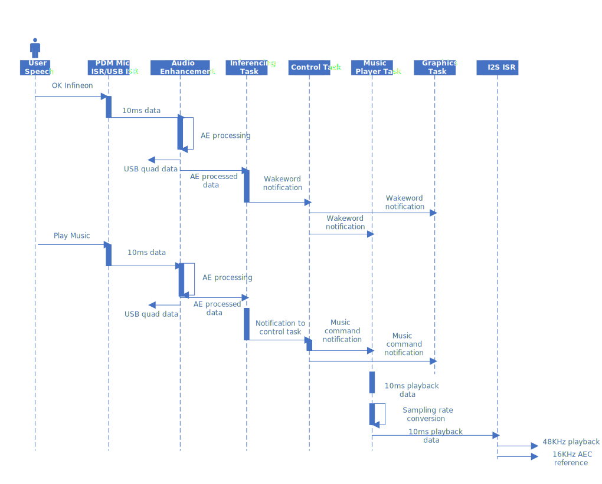
   

### Audio pipeline tuning and customization (how to's/tips)

This section delves into the the customizability of the audio pipeline.

The AFE Configurator tool lets you choose and customize the AFE components that run on PSOC&trade; Edge. It requires the AFE Configurator project file provided in the CE, available in: 
*proj_cm55\source\mains_powered_application\audio_enhancement\mains_powered_ae_config.mtbafe*.

Open this project file using **any one** of the following steps: 

- Open *mains_powered_ae_config.mtbafe* using the AFE Configurator tool via Eclipse IDE

- Click **Audio FE Configurator** under **proj_cm55** in Eclipse IDE
    
- If not using Eclipse IDE, open the *proj_cm55* folder in the modus-shell and run `make audio-fe-configurator`
    
- Open the *mains_powered_ae_config.mtbafe* via *audio-fe-configurator.exe* located in *C:\Users\[username]\Infineon\Tools\DEEPCRAFT-Audio-Enhancement-Tech-Pack\tools\audio-fe-configurator*

The PDM mic mode is controlled by the AFE Configurator. To choose between mono or stereo input, choose the options as:

**Figure 3. AFE Configurator: Choose between mono or stereo input**

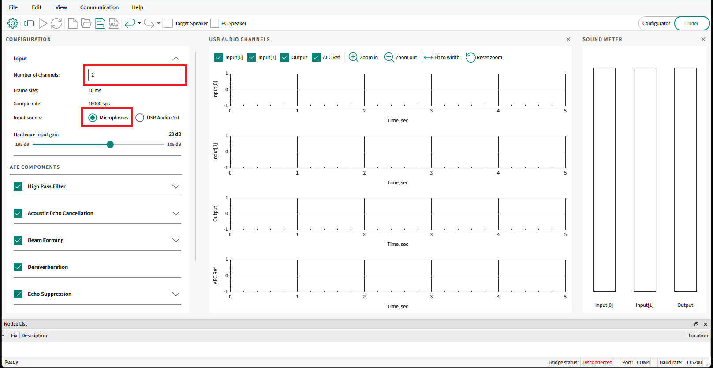
    
If you select **USB Audio Out**, the PDM mic is not enabled. You can stream audio via USB for benchmarking. In **USB Audio Out** mode, it is always stereo input.

The AFE Configurator generates *cy_afe_configurator_settings.c* and *cy_afe_configurator_settings.h* files when saving the project containing the AFE filter settings and other options such as the components enabled. AFE relies on statically compiled files for this operation. 

The GeneratedSource contains the _*.c_ and _*.h_ files and these codes are automatically built during the build process. They are available at *proj_cm55\source\mains_powered_application\audio_enhancement\GeneratedSource*

A limited set of parameters can be set dynamically using AFE Configurator. To send the parameters to the PSOC&trade; Edge MCU: 

1. Close Tera Term or any other UART Terminal windows on the PC

2. Connect the AFE Configurator to the PSOC&trade; Edge MCU.

    The AFE Configurator command/response is communicated via UART. Since the same KitProg3 USB UART is used for debugging, once AFE Configurator is connected, all logs from the PC are diverted to AFE Configurator log file, saved on the PC while syncing the settings. 

    To see the logs, switch between TeraTerm and AFE Configurator 

3. To connect the AFE Configurator to the kit, select the icon as shown here:

    **Figure 4. Connect AFE Configurator to the kit**

    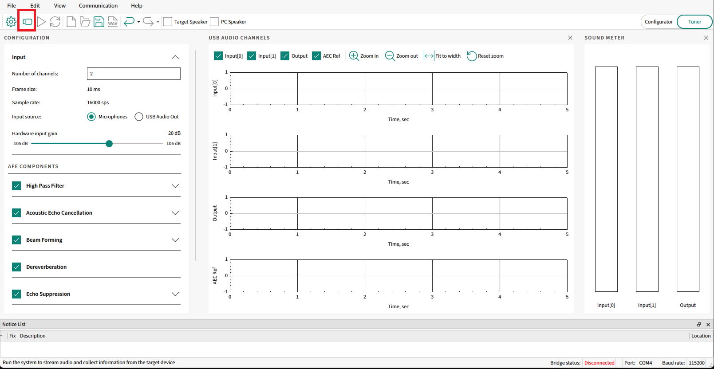

4. Ensure that the bridge status is shown as connected

    **Figure 5. Bridge status**

    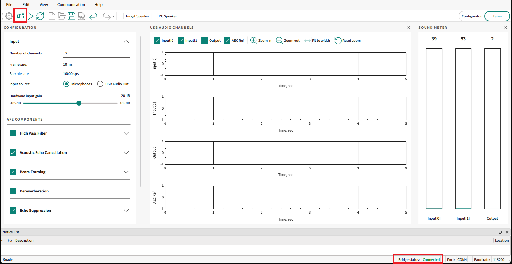

    Set the following parameters dynamically using AFE Configurator:
 
    **Figure 6. Dynamic configuration**
  
    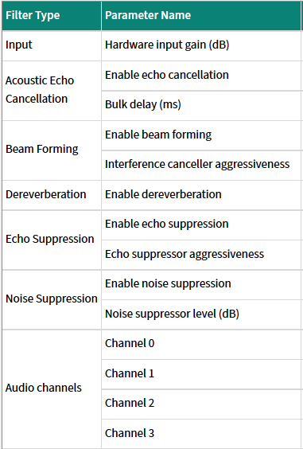
  
    For example, to disable **Noise Suppression**, unselect **Noise Suppression** and select **Sync filter settings** > **Load to device**
    
    **Figure 7. Dynamic configuration – Example**
    
    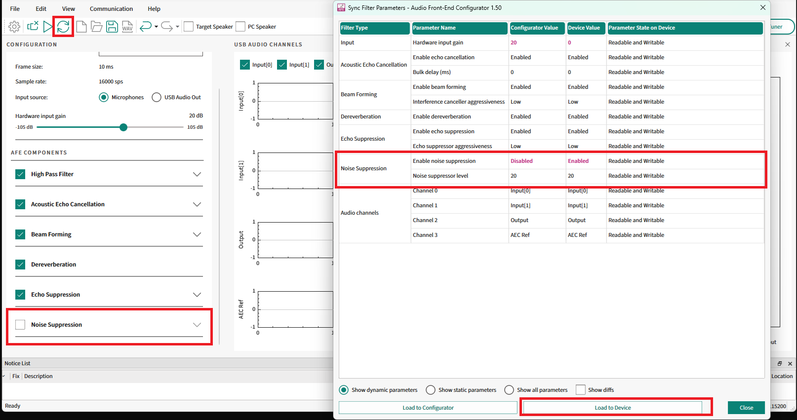

5. Check the processed audio recorded via Audacity. Noise suppression should be disabled and the processed audio should have background noise


### AFE tuning

The example also supports debugging or tuning the AFE via USB. By default in this code example, the PSOC&trade; Edge MCU is enumerated as a 4-channel/quad microphone to the PC. This mode is for debugging or tuning and to understand the AFE output for each of its components.

Ensure to connect USB cable to the "device port" of the kit so that PSOC&trade; Edge MCU kit enumerates to the PC as 4 channel mic (Microphone-Audio Control) and Stereo speaker (Speaker-Audio Control) 

1. Choose the four individual channels to debug using the AFE Configurator:
   
    **Figure 8. AFE Configurator: Choosing individual channels**
    
    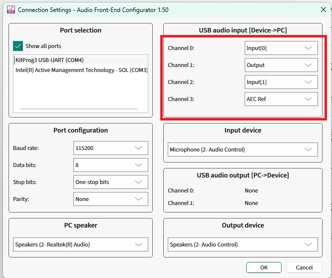

2. After choosing the required data to stream back from the PSOC&trade; Edge MCU to PC, save the AFE project

3. Build and flash the code

4. To view the four channels, use Audacity or the AFE Configurator:

    - **Audacity:** Set the driver to WASAPI and set the channels to four by chosing the (Audio Control) Microphone. Set the **Sampling rate** to **16 kHz** and other settings as shown here:

      **Figure 9. Audacity: Configuration to view quad channel output**
      
      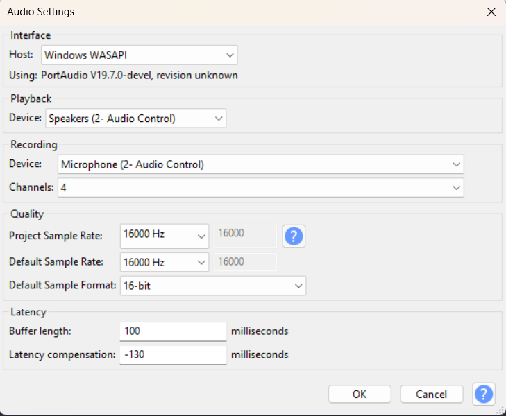

      This lets you view the quad channel output to debug AFE

      **Figure 10. Audacity: Quad channel display**
      
      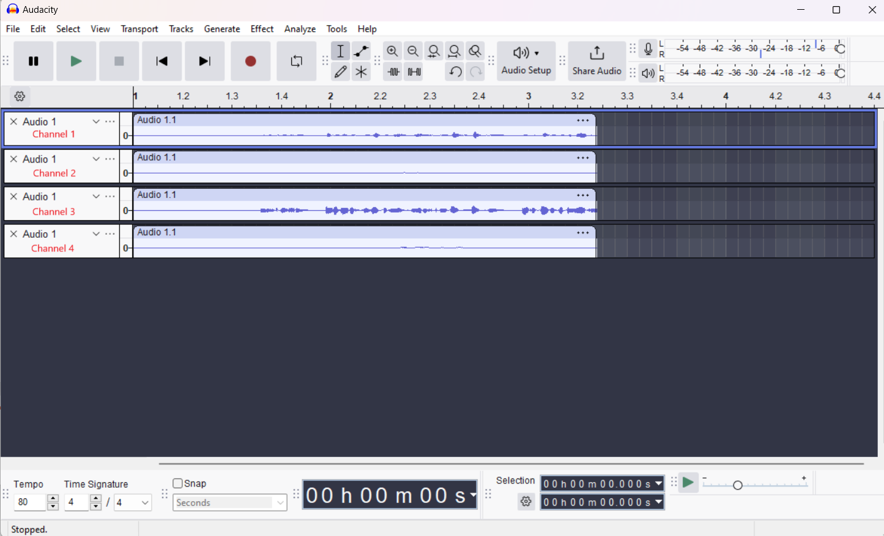

    - **AFE Configurator:** 
      1. Connect AFE Configurator to the device <br>

      2. Select the play icon, record for a while, and press the stop icon
      
          **Figure 11. AFE Configurator: Play icon**
          
          
      
          **Figure 12. AFE Configurator: Stop icon**
          
          
          
          This makes AFE Configurator display the four channels:
          
          **Figure 13. AFE Configurator: Quad channel display**
          
          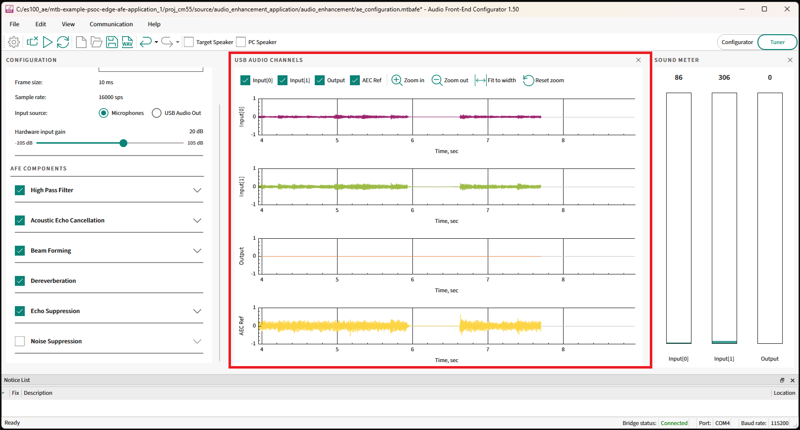
 
      3. Press stop and save the quad channel audio using the save recording icon
      
          **Figure 14. AFE Configurator: Save icon**
          
          

      4. Use Audacity to import the file for further analysis

> **Note:**

> 1. The playback on the **Target Speaker** option in AFE Configurator is not supported in this code example

> 2. AEC Calibrate option is not enabled in this CE as the audio playback is tied to the music player use case.

> 3. To fully utilize AFE configurator features, see the [DEEPCRAFT&trade; audio enhancement code example](https://github.com/Infineon/mtb-example-psoc-edge-ae-application)


**DEEPCRAFT&trade; voice assistant inference engine training details**

For voice assistant model training and customization, Infineon has a cloud-based training framework. To access it, create an account at [DEEPCRAFT&trade; Voice Assistant cloud tool](https://deepcraft.infineon.com/solutions/voice-assistant). The tool uses a graph topology that lets you map the flow and train the model.

**Figure 14. Voice assistant overview**

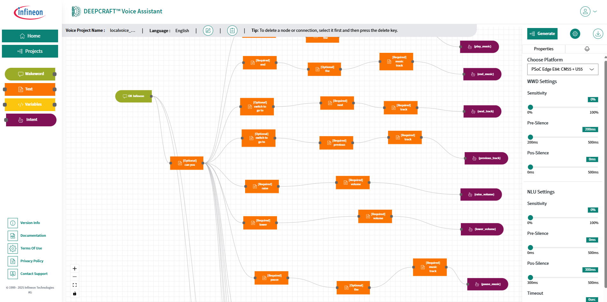

This code example includes the default voice assistant project file for music player use case to import into the cloud tool, available at *proj_cm55\source\mains_powered_application\inferencing_interface\COMPONENT_VOICE_ASSISTANT\va_proj*

For training a new cloud project,

1. After logging in, select **Design New Project** for a new project 

    or,

    if you have an existing *.vaproj* file, select **Import Project**
  
    **Figure 15. Design or import project**
    
  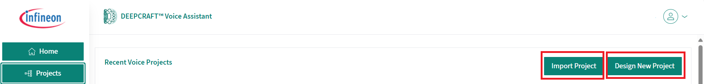

2. For adding a wakeword, like "Ok Infineon", select as shown here:

    **Figure 16. Adding wakeword**
    
    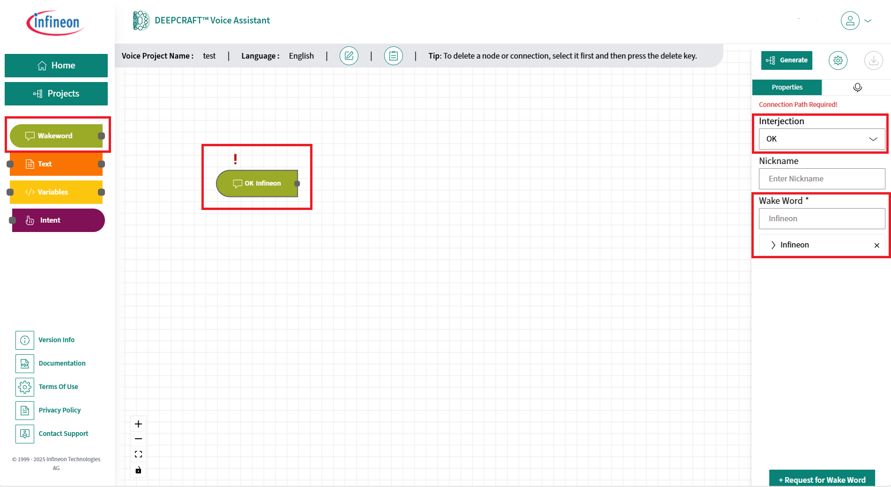

3. To add the commands, select the **Text** options. To add numbers, select **Variables**. Ensure to add the required details in the **Properties** tab on the right. 

    > **Note:** In the image below, there are **Optional** and **Required** words in the command flow. It shows "can you play the song" where "can you" is optional word:

    **Figure 17. Voice assistant commands**

    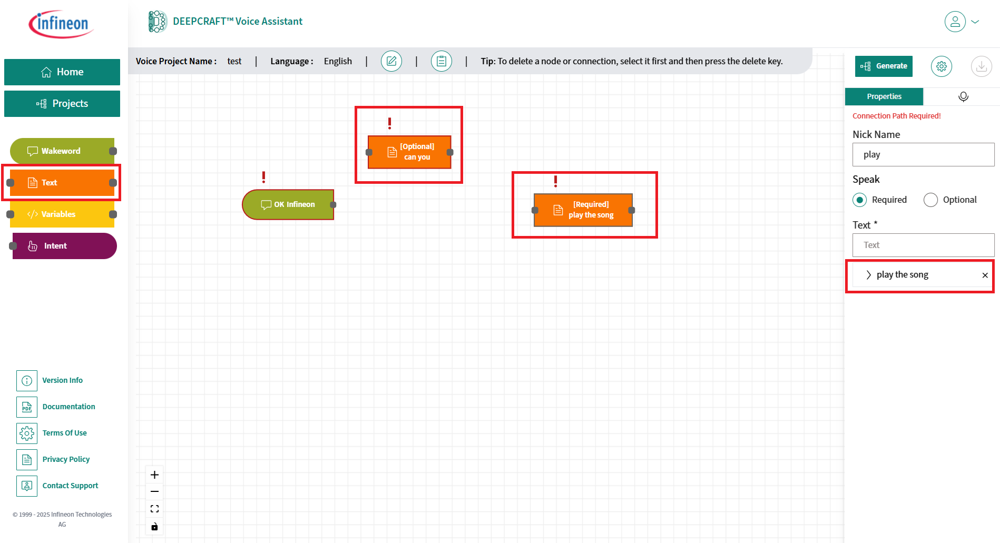

4. Each command flow should me mapped to an intent. Choose the **Intent** option and add the intent label. Ensure to connect all the nodes
  
    **Figure 18. Mapping command flow to intent**
  
    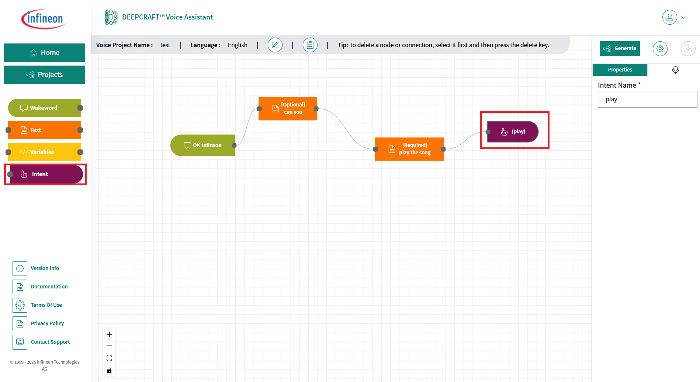

5. After adding all the commands and intent flows, choose the **CM55+U55** option (only this option is supported) and click **Generate**
  
    **Figure 19. Choosing CM55+U55**

    

    **Figure 20. Generating the model**
    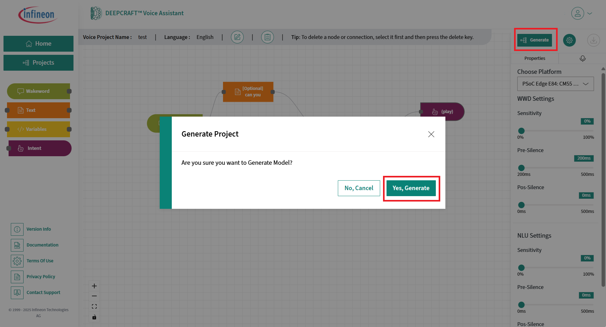

6. Once the model is generated, download the files

    **Figure 21. Downloading files**

    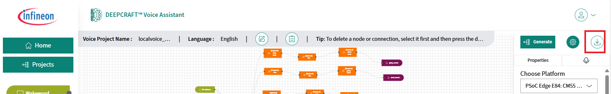

7. Copy and paste all downloaded files to *proj_cm55\source\mains_powered_application\inferencing_interface\COMPONENT_VOICE_ASSISTANT\va_model*

8. In *proj_cm55*/*Makefile*, set the name `DEEPCRAFT_PROJECT_NAME=[name of the VA project]`, which is the VA cloud project name prefixed to the downloaded files

9. Add the intent macros and command IDs for the new model in *proj_cm55\source\mains_powered_application\inferencing_interface\inferencing_interface.h*, for example:

    **Figure 22. Adding command IDs and intent macros**
      
    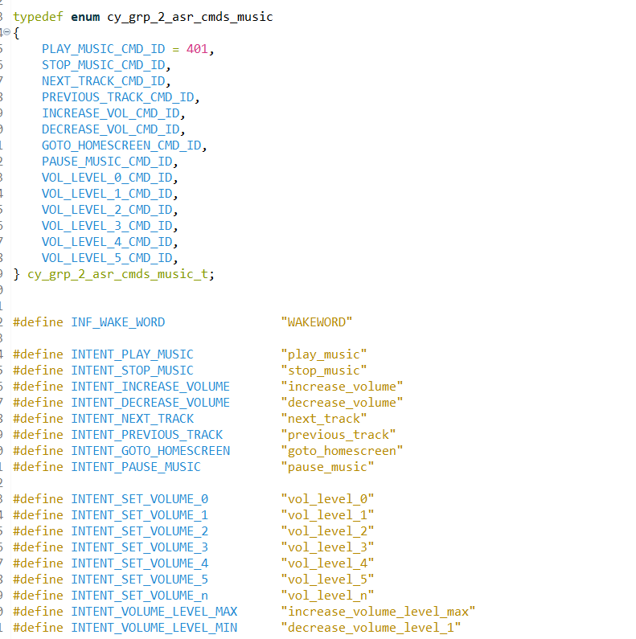

    Or,

    Reuse the macros in the downloaded file: *proj_cm55\source\mains_powered_application\inferencing_interface\COMPONENT_VOICE_ASSISTANT\va_model\app_[project_name].h*

10. Update the `va_intent_to_id()` API in *proj_cm55\source\mains_powered_application\inferencing_interface\COMPONENT_VOICE_ASSISTANT\va_inferencing.c*, which sends the command ID to the control task

11. In the control task, handle the command ID and perform required post-processing such as sending the id to another task like graphics and music player

    See the **Code flow** Section in this design guide above for the code flow

12. The *proj_cm55\source\mains_powered_application\inferencing_interface* is abstracted, so you can switch inferencing engines

    If the inferencing engine is changed, switch `CONFIG_INFERENCING_LIB=[new lib]` in *common.mk* and add the respective API in *inferencing_interface.c* so the application calls the abstracted API


### KPI

The memory and MCPS of audio enhancement with all AFE components enabled on the PSOC&trade; Edge MCU are shown in here:

**Figure 23. AE – memory and MCPS with AFE components**

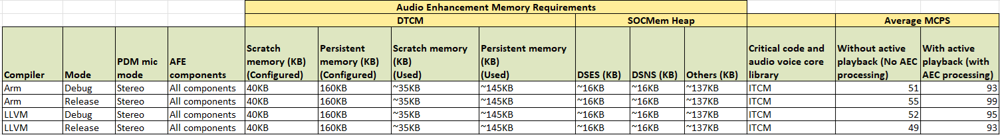

To provide the highest performance while executing the code example, the AFE middleware's scratch and persistent memory are placed in the tightly coupled memory section (TCM).

```
uint8_t ae_scratch_memory[AE_ALGO_SCRATCH_MEMORY] __attribute__((section(".dtcm_data"), aligned(4)));
uint8_t ae_persistent_memory[AE_ALGO_PERSISTENT_MEMORY] __attribute__((section(".dtcm_data"), aligned(4)));

```

For more information, see: *proj_cm55\source\mains_powered_application\audio_enhancement\audio_enhancement.c*.

The code uses custom linker scripts to place critical code and libraries in TCM and sections in SOCMem. The custom linker scripts are placed in the templates folder for Arm&reg; and LLVM compilers.

See the linker scripts for the file placement and data placement in the respective sections.

The custom linker scripts are placed in:

- *\templates\TARGET_KIT_PSE84_EVAL_EPC4\COMPONENT_CM55\TOOLCHAIN_ARM\pse84_ns_cm55.sct*

- *\templates\TARGET_KIT_PSE84_EVAL_EPC2\COMPONENT_CM55\TOOLCHAIN_ARM\pse84_ns_cm55.sct*

- *\templates\TARGET_KIT_PSE84_EVAL_EPC4\COMPONENT_CM55\TOOLCHAIN_LLVM_ARM\pse84_ns_cm55.ld*

- *\templates\TARGET_KIT_PSE84_EVAL_EPC2\COMPONENT_CM55\TOOLCHAIN_ARM\pse84_ns_cm55.ld*

Depending on the chosen compiler and BSP, one of these scripts is used. The custom linker scripts are auto-copied to the BSP folder while importing the project. If you make any modifications to them, you have to manually copy them to the *bsp* folder.

The code example also uses *custom design.modus* for memory section changes, *design.qspi* for Octal SPI flash that has improved performance,
and the custom secure project that executes from the RRAM.

To profile the AFE middleware for the cycles: 

1. Enable the following in the *Makefile* of *proj_cm55*:

    ```
    #For Profilier
    COMPONENTS += PROFILER
    DEFINES += PROFILER_ENABLE
    ```

2. Enable the following flag in 
*proj_cm55\source\mains_powered_application\audio_enhancement\audio_enhancement_interface.h*:

    ```
    #define AE_APP_PROFILE  (1)
    ```

To profile Voice Assistant for the cycles:

1. Enable the following in the *Makefile* of *proj_cm55*:

    ```
    #For Profilier
    COMPONENTS += PROFILER
    DEFINES += PROFILER_ENABLE
    ```

2. Enable the following flag in 
*proj_cm55\source\mains_powered_application\audio_enhancement\audio_enhancement_interface.h*:

    ```
    #define INFERENCING_PROFILE  (1)
    ```
The MCPS for Voice Assistant is shown below,

**Figure 23. AE – memory and MCPS with AFE components**

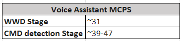